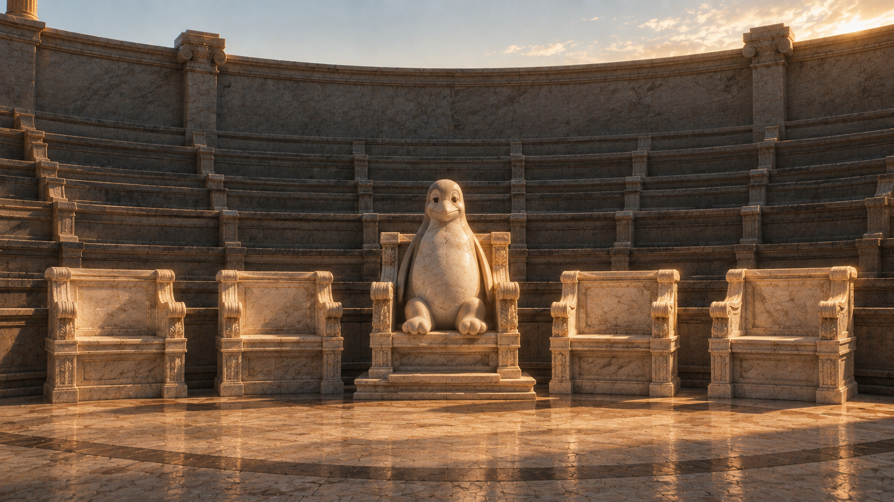
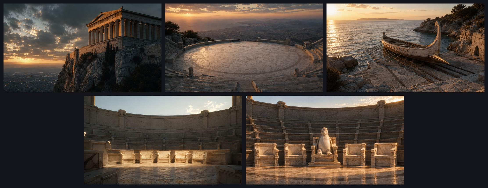

# Omarchy Oligarchy Theme

A dark, old-money theme for [Omarchy](https://omarchy.org). Charcoal surfaces,
sterling-silver chrome, and pearl text. Oxblood appears only where it means
something.

Tux has a seat on the council. The other four are empty. The penguin is the chair.

Wealth is not a color scheme. But it could be.





## Install

```bash
omarchy theme install https://github.com/abhi152003/omarchy-oligarchy-theme
```

## Palette

| Role | Hex |
| --- | --- |
| Background | `#12141a` (charcoal) |
| Dark background | `#0d0f14` |
| Darker background | `#090a0e` |
| Lighter background | `#1a1d26` |
| Foreground | `#d8dbe3` (pearl) |
| Accent | `#9aa3ad` (sterling) |
| Selection | `#2a3038` |
| Muted | `#7e8892` |

Full ANSI palette in [`colors.toml`](colors.toml). Errors and alerts read in
oxblood `#7a2e2e`. Icons are `Yaru-dark`.

The committee will see you now.
